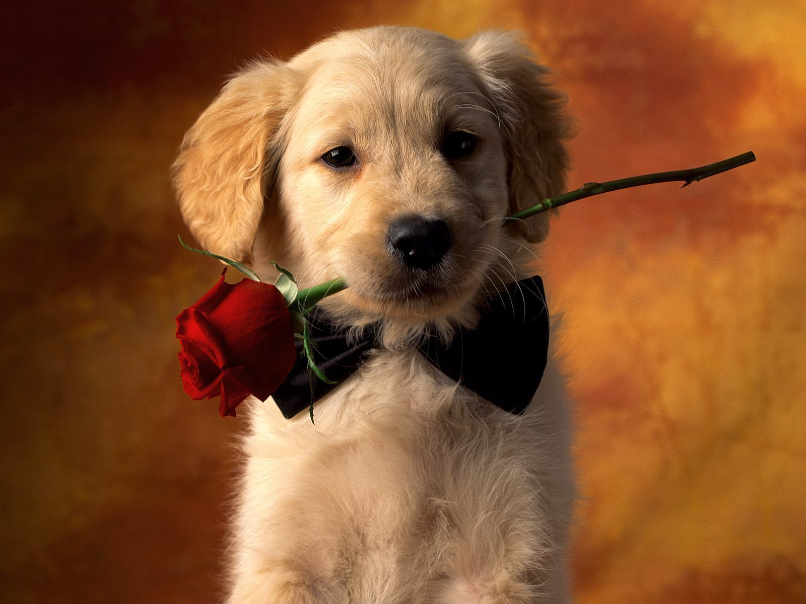

# ReplaceCats

A JavaScript function that replaces all images on a page with cat pictures.

You can either load the script from `script.js` through the console, or you can add a new bookmark to your browser and set the link for the bookmark to the code in the script `bookmark.js`.

## Test It Out

Bookmark the code and then test it here to replace the puppies!

Enjoy!

Created by Grant Campfield on 2/26/2015 &copy;
